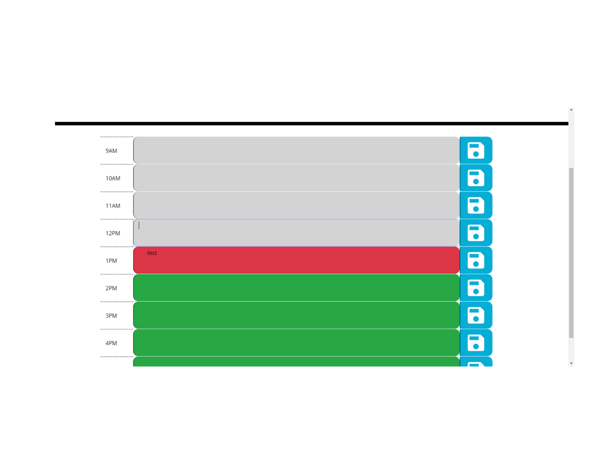

# Day Planner

This is a simple day planner for a 9-5pm work day. You'll be able to put your appointments in and save them for the day so that you can effectively manage your day better.

## Business Context

Poor time management can result in missed meetings and deadlines or create the appearance of unprofessionalism. A daily planner allows employees to see their day at a glance, schedule time effectively, and improve productivity. 

### Credits

Several team players helped direct me when I was off base.  Crredits go to :  Max Allee, Kaighan Finely, Leah Barnes, Jim Gray, Lara ELler, Ryan Diaz, Christian Saxton, Rodney Brenes and Patrick Dorgu.

